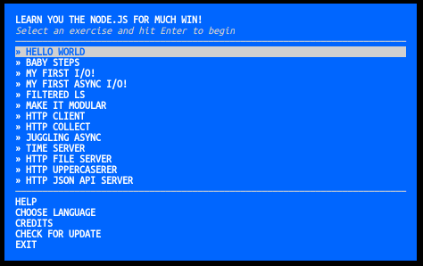
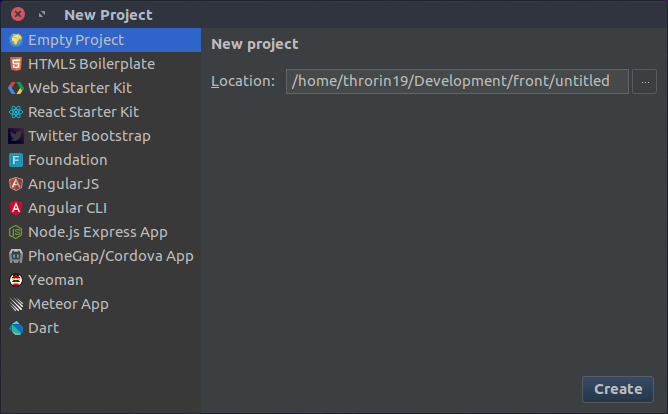
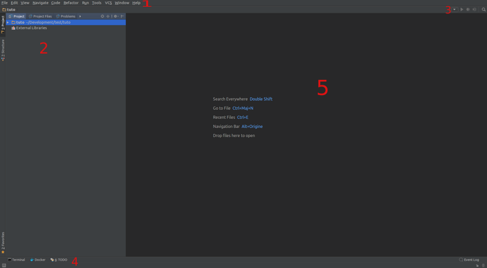

# TD : Introduction

<center>

<br>
<br>
</center>

Tous les TP se présenteront de la manière suivante :

+ Une introduction de la technologie/module utilisés sur le TP via l'utilisation des cours fournis par nodeschool.io.
+ Un projet à réaliser durant toute la durée du module.

Ce TD réalise les objectifs suivants :

- Installation de NVM
- Prise en main de nodeschool.io
- Revue des bases de Javascripts et des normes ES6
- Installation de l'environnement de développement
- Utilisation du debugger

<br>
<br>

## Installation de NVM

Selon que vous êtes sous Linux/Mac ou Windows, l'installation sera quasiment identique. Sauf que pour windows, vous devez **absolument** passer par le bash Ubuntu. Je prends pour acquis que tout le monde est sur une base Linux/MacOS n'ayant pas de post windows à disposition.

Pour l'installation de nvm, je vous recommande de voir tout ce qui est indiqué sur le sujet directement sur le site du projet : https://github.com/creationix/nvm

**Attention** : tous les TP seront fait sur la version 8 LTS (long support) de NodeJS. Il s'agit de la version `8.9.0` au moment de la rédaction de ce TD.

```
nvm install v8
nvm use v8
```

Dans le doute, pensez à mettre cette version en version par défaut :

```
nvm alias default v8
```

## NodeSchool.io

Le site [nodeschool.io](https://nodeschool.io/fr-fr/) répertorie plusieurs exercices interractifs afin de vous apprendre l'utilisation d'un concept, d'un module nodeJS ou d'une technologie javascript directement dans votre terminal.

Pour tous les "turoriels", vous aurez une *installation globale* d'un module nodeJS à faire sur votre poste de la manière suivante :

```
npm install -g <module>
```

Et pour le lancer, vous aurez juste la commande suivante à taper :

```
<votremodule>
```

<br>

Normalement vous devriez arriver sur un écran de ce genre :

<center>

<br>
<br>
</center>

**Attention** : De base, les "tutoriels" sont en anglais. Heureusement, ceux que vous ferez au travers de ces TP sont disponibles en français (sauf rares exceptions). Pensez-bien à changer la langue si celle de Shakespear vous rebute un peu.

## ES6, Asynchrone et Clojures

Nous allons commencer ce TP avec la réalisation des *tutoriels* suivants :

- `javascripting` : Si vous voulez vous rappeler les bases du développement javascript, faites le, sinon passez au suivant.
- `scope-chains-closures` : Apprenez le détail des Scope, Scope Chains, Closures, et Garbage Collection.
- `learnyounode` : Apprenez les bases de node : asynchronous i/o, http.
- `count-to-6` : Apprenez comment utiliser les caractéristiques de ES6.

Tous ces tutoriels vous serviront à comprendre le fonctionnement fondamental de javascript et de Node.JS ,et , bien entendu, ils sont nécessaires pour la suite du module.

<br>

## Webstorm

Webstorm est l'un des IDE fournit par Jetbrains. Bien entendu, vu la base qu'ont tous les éditeurs de Jetbrains, cette partie marchera aussi, dans les grandes lignes, pour PHPstorm, Pycharm, ...

### Installation

Pour l'installation/lancement de Webstorm, je vous conseille de passer par le logiciel JetBrains toolbox permettant de facilement accéder à un projet particulier mais aussi de gérer l'installation/maj/lancement de tous les éditeurs que Jetbrains fournit. Vous trouverez la toolbox via le lien suivant : [https://www.jetbrains.com/toolbox/app/](https://www.jetbrains.com/toolbox/app/)

Ensuite quand vous lancez la toolbox, voud devriez avoir cette fenêtre :

<center>

</center>

Vous n'avez plus qu'à installer le(s) éditeur(s) de votre choix. Dans notre cas : **Webstorm**.

<br>
<br>
<br>
<br>

### Utilisation

Pour l'utilisation de webstorm, dans le cadre du projet du TP, je vous conseille de commencer par un *empty project* :

<center>

<br>
<br>
</center>

Et là, vous devriez arriver sur la fenêtre suivante :

<center>

<br>
<br>
</center>

1. Barre de contrôle pour créer un fichier, accéder aux settings, ...
2. Fenêtre d'exploration du projet.
3. Barre de lancement de votre application et de debug.
4. Barre d'accès aux différents outils (terminal, VCS, ...)
5. Fenêtre d'édition

### Réglages de base pour un projet NodeJS :

1. Allez dans les Settings (**File => Default Settings...**)
2. Allez dans l'onglet **Languages and Frameworks => Javascript**.
3. Passez *Javascript language version* à **ECMAScript 6**.
4. Cochez **Prefer Strict Mode**
5. Allez dans **Languages and Frameworks => Node.JS and NPM**.
6. Choisissez le binaire de node v8.9.0 qui devrait être dans `~/.nvm/versions/node/v8.9.0/bin/node`
7. Activez l'assistance du code de Node.JS
8. Appliquez les changements
9. Vous devrez faire la même chose exceptionnellement pour le projet en cours via **File => Settings**.

Normalement après ces réglages par défaut, tous vos projets devraient prendre en compte ES6 et nodeJS 8.9.0

### Lancement de son application

Vous allez créer dans votre projet un fichier `server.js` contenant le code suivant :

```javascript
'use strict';

const http = require('http');

let server = http.createServer((request, response) => {
  response.writeHead(200, {"Content-Type": "text/plain"});
  response.end("Hello World\n");
});

server.listen(8000);

console.log("Server running at http://127.0.0.1:8000/");
```

<br>
<br>

1. Dans la barre de lancement de votre application, cliquez sur la flèche descendante puis sur *Edit configuration*.
2. Cliquez sur l'icône **+** puis sur **Node.js**
3. Dans la ligne *Node Interpreter*, vérifiez que vous êtes bien sur la v8.9.0 sinon mettre le bon chemin (`~/.nvm/versions/node/v8.9.0/bin/node`)
4. Dans *Working directory*, ciblez votre projet
5. Dans *Javascript File*, mettez bien `server.js`.
6. Mettez le nom que vous voulez dans *Name*.
7. Validez

Vous devriez normalement vous retrouver avec ceci :

<center>

<br>
<br>
</center>

+ Le bouton *play* représenté par la flèche verte sert à lancer l'application normalement.
+ Le bouton *Debug* représenté par l'insect vert permet de lancer l'application en mode Debug (merci captain Obvious).

La partie Debug sera traité dans un TP propre plus tard. Pour le moment clquez uniquement sur la flèche verte. Vous devriez voir une fenêtre s'ouvrir avec la phrase `Server running at http://127.0.0.1:8000/`.

Et si vous ouvrez le navigateur pour aller à l'adresse indiquée, vous devriez avoir le message `Hello World`.
