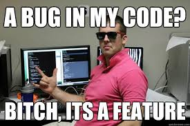
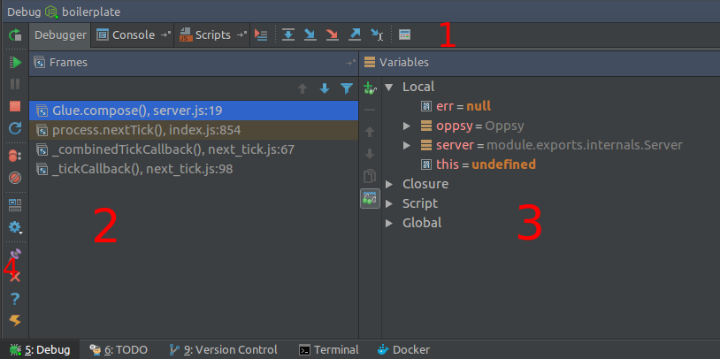
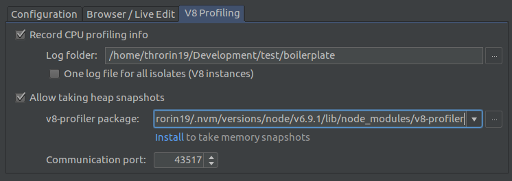
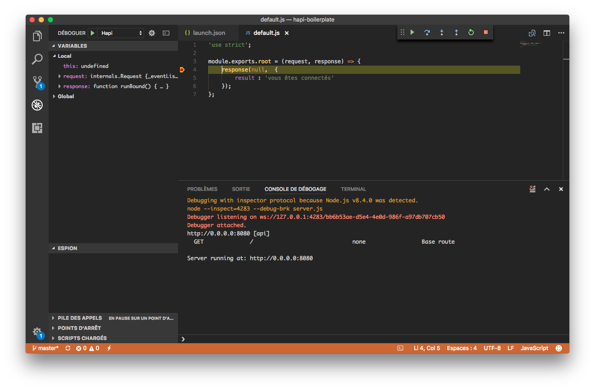

# TP 1 : Analyse, Debug et Eslint

<center>

</center>

## Webstorm

### Lancement de son application

1. Dans la barre de lancement de votre application, cliquez sur la flèche descendante puis sur *Edit configuration*.
2. Cliquez sur l'icône **+** puis sur **Node.js**
3. Dans la ligne *Node Interpreter*, vérifiez que vous êtes bien sur la v8.X sinon mettre le bon chemin (`~/.nvm/versions/node/v8.9.0/bin/node`)
4. Dans *Working directory*, ciblez votre projet
5. Dans *Javascript File*, mettez bien le fichier d'entrée de votre projet.
6. Mettez le nom que vous voulez dans *Name*.
7. Validez

<br>

Vous devriez normalement vous retrouver avec ceci :

<center>

<br>
<br>
</center>

+ Le bouton *play* représenté par la flèche verte sert à lancer l'application normalement.
+ Le bouton *Debug* représenté par l'insect vert permet de lancer l'application en mode Debug.

### Mode Debug

Comme vu plus haut, vous pouvez simplement lancer votre tâche en mode Debug en cliquant sur le bouton d'insecte.

En faisant ça, si jamais votre tâche est déjà en cours d'exécution, elle sera relancée en mode debug. Et, normalement, vous devriez avoir le panneau suivant de disponible :

<center>

<br><br>
</center>

1. Bandeau de navigation permettant d'accéder aux parties suivantes :
    - `debugger` : Permet d'avoir accès au panneau de debug
    - `console` : Permet de voir le stdIn et le stdOut du programme
    - `script` : Liste des scripts rattachés au debugger
    - Les boutons de navigation au sein du code, des appels et des différents breakpoints.
2. Callstack de votre breakpoint.

<br>

3. Variables disponibles avec les valeurs courantes au moment de l'arrêt sur le breakpoint :
    - `local` : variables de la fonction en cours d'appel
    - `closure` : variables externes à la fonction mais accessibles dans celle-ci.
    - `script` : variables du fichier contenant le breakpoint.
    - `global` : obvious.
4. Boutons de contrôles.

Quand un de vos point d'arrêt est atteint par le programme, l'éditeur vous le met en évidence comme ceci :

<center>

<br><br>
</center>

Comme vous pouvez le voir, l'éditeur vous met en surimpression les valeurs des variables.

### Profiling V8

Si vous voulez essayer d'optimiser la gestion mémoire, trouver un quelconque goulot d'étranglement ou bien de savoir comment Node.JS gère l'exécution de votre programme, vous pouvez effectuer un profiling de votre projet.

Avant de commencer, vous devrez installer un module NPM en global :

```
npm install -g v8-profiler
```

Ensuite, dans la fenêtre de configuration du lancement/debug, vous devrez aller dans l'onglet `v8 profiling` et le remplir de la façon suivante :

<center>

<br><br>
</center>

Maintenant, à chaque fois que vous allez arrêter l'exécution du programme, Webstorm va vous ouvrir la fenêtre de profiling v8 correspondant à toute la durée d'exécution.

Vous trouverez la documentation complète ici : https://www.jetbrains.com/help/webstorm/2016.3/v8-cpu-and-memory-profiling.html

**Attention** : Si vous faites tourner votre programme longtemps et qu'il a beaucoup d'appels, la mémoire de base de webstorm ne sera pas suffisante à l'analyse de la heap.

## Visual Studio Code

Visual Studio Code est un autre IDE permettant de développer sur différents langages et pouvant être étendu au travers de différents plugins. Visual Studio Code est un *fork* d'**Atom**, et, comme lui, il est codé en Node.JS.

Il faut savoir que, comparé à webstorm, VisualStudio Code se configure via des fichiers JSON à placer dans le répertoire `.vscode` à la recine de votre projet. **Il est plus que conseillé de mettre ce répertoire dans la liste des éléments ignorés par GIT.** En effet vous mettez ici tout ce qui converne le lancement du projet sur votre poste.

Tout ce qui touche au lancement d'un projet se place dans le fichier `launch.json`. Le plus simple est d'en créer un vide, et, quand vous allez dedans pour l'éditer, vous verrez en dessous le bouton `Add a configuration`.

<br><br><br><br><br><br>

Vous devrez vous retrouver avec le contenu suivant :

```
{
    "version": "0.2.0",
    "configurations": [],
    "compounds": []
}
```

Placez votre curseur dans le tableau du field `configurations` puis clieuz de nouveau sur le bouton d'ajout de configuration.

Normalement vous avez une liste déroulante listant les différentes configurations possibles. Sélectionnez celle pour `Node.JS : lancer un programme` et, normalement, vous devriez avoir quelque-chose comme ceci :

```
{
   "type": "node",
   "request": "launch",
   "name": "Launch Program",
   "program": "${workspaceRoot}/app.js"
},
```

Pour résumer, voici les champs utiles :

- Name : nom de la tâche à lancer
- program : fichier node.JS d'entrée. La variable `${workspaceRoot}` correspond à la racine de votre projet.

Vous pouvez ajouter d'autres paramètres comme, par exemple, les variables d'environnement via le field `env` et donnant par exemple la chose suivante :

```
{
    "type": "node",
    "request": "launch",
    "name": "Hapi",
    "program": "${workspaceRoot}/server.js",
    "env": {
        "ENVIRONMENT" : "local"
    }
}
```

<br>

Vous trouverez toute la [documentation officielle ici](https://code.visualstudio.com/docs/editor/debugging).

> Pour ceux sur Windows, vous trouverez [comment activer l'utilisation de vos programmes installés via WSL ici](https://blogs.msdn.microsoft.com/commandline/2017/10/27/running-node-js-on-wsl-from-visual-studio-code/)

Maintenant, pour lancer votre programme en mode Debug, rien de plus simple :

- Soit vous appuyez sur `F5` (ou vous avez la commande `CTRL + F5` pour le mode non debugger mais ne marche pas avec tous les types de programmes)
- Soit vous allez dans `Debogger > Demarrer le deboggage` (et `démarrer sans déboggage` pour le mode non debugger)

Quand le debug se lance, vous avez cette toolbar qui apparaît :

<center>

<br>
</center>

Quand un de vos point d'arrêt est atteint par le programme, l'éditeur vous le met en évidence comme ceci :

<center>

</center>

Vous retrouvez toutes les infos sur vos variables dans l'onglet de gauche intitulé simplement : **Variables**. Ces variables sont notées par niveau de bloc.

## ESLint

EsLint permet de vérifier si la norme de codage est appliquée comme il faut ou non. Ceci est particulièrement utile si vous travaillez à plusieurs afin d'avoir une bonne lisibilité du code entre chacun.

Afin de partir sur de bonnes bases, vous allez suivre les guidelines de HapiJS : https://github.com/cjihrig/eslint-config-hapi

Afin de dire à eslint de les appliquer, vous devez installer certains modules en devDependencies :

```
npm install --save-dev eslint eslint-config-hapi eslint-plugin-hapi
```

Ensuite, il faut savoir que vous devrez avoir des fichiers de configuration d'esLint dans votre projet :

- `.eslintignore` : Liste des fichiers et dossiers à ignorer.
- `.eslintrc.json` : Configuration esLint.

Voici le contenu du fichier `.eslintignore` :

```
# ignore les modules node
node_modules
```

Et voici le contenu de base de `.eslintrc.json`

```
{
  "extends": "eslint-config-hapi"
}
```

Pour toutes les informations complémentaires ou pour ajouter/modifier des règles, vous trouverez votre bonheur ici : http://eslint.org/

Pour finir, vous devrez, dans les paramètres de webstorm, activer esLint pour que vous soyez notifier, lors de l'édition, de ces erreurs comme mis dans la capture suivante :

<center>

<br><br>
</center>
