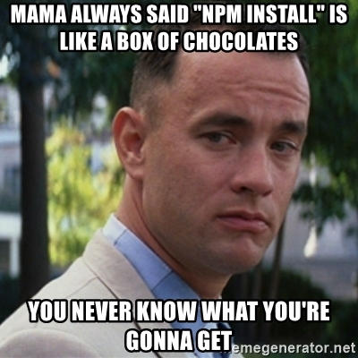

# TP2 : NPM

<center>

<br>
<br>
</center>

Ce TP a pour but de vous initier au gestionnaire de paquet NPM.

## NPM

### Introduction

NPM pour **N**ode **P**ackage **M**anager sert à installer différents packages au sein de votre projet ou de votre système. Avant de rentrer dans les détails, voici le tutoriel nodeschool.io qui se rattache à ce que nous allons voir :

- `how-to-npm`

### Le scope

Le **scope** permet de publier un package au sein d'un "nom d'organisation" sous la forme `@organisation`. Au lieu par exemple d'installer le package via :

```
npm install monpackage
```

vous l'installerez via

```
npm install @organisation/monpackage
```

### Package.json

Le fichier `package.json` de notre projet ressence toutes les libraries externes de notre projet, les différentes commandes disponibles via `npm` et pleins d'autres informations propres au build, publication, ...

Nous allons nous concentrer ici sur les champs `devDependencies`, `dependencies` et `peerDependencies`.

- `dependencies` : Ce sont les dépendances principales de votre module. Elles permettent à celui-ci de fonctionner correctement en production lorsqu'il est compilé (si besoin).
- `devDependencies` : Ce sont toutes les dépendances dont vous avez besoin pour développer et tester votre projet (par exemple toutes les extensions gulp propre à la compilation de votre projet front).
- `peerDependencies` : Ici cela permet de valider la résolution des dépendances entre votre package et un autre.

Pour plus d'informations sur `peerDependencies`, je vous invite à lire cet article (en anglais) : https://nodejs.org/en/blog/npm/peer-dependencies/.

Bien entendu, outre la résolution des dépendances, vous avez aussi la résolution des versions des dépendances. De base, npm installe toujours la version avec un `^` juste devant.

Ex : `"hapi" : "^17.4.1"` peut vous installer, lors du premier `npm install` une version de `hapi` entre la `17.4.1` et la `18.0.0`.

Pour vérifier tout ceci, je vous invite à jeter un oeil à cet article chez NPM : https://docs.npmjs.com/misc/semver

### Réalisation de notre premier module

**Attention** : Ce package servira dans un prochain TP afin de voir comment l'utiliser dans votre projet.

Réalisation d'un module de cryptage de mots de passe permettant de simplifier les appels du module `encrypt` fourni par Node.JS.

Vous devrez créer le projet sur github afin de le publier ensuite au sein de NPM via un scope. Le scope permet de créer des packages NPM dits "privés". Cela vous permet de créer des packages NPM du nom d'un package existant mais préfixé par votre login de la forme `@loginNPM/packageName`.

Le nom du package sera donc `@votreloginNPM/iut-encrypt`.

Vous devrez pouvoir encoder un mot de passe en sha1 mais pensez votre module comme évolutif pour pouvoir rajouter d'autres méthodes dans le futur.
